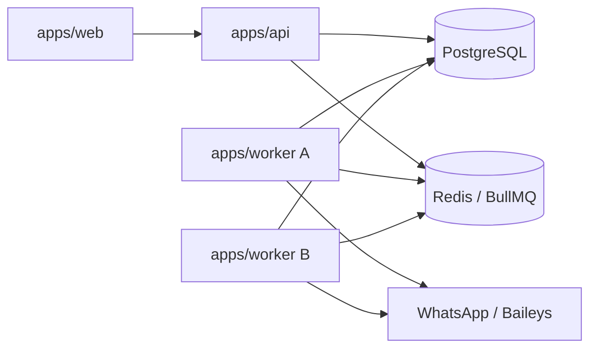

# Arquitetura escalável para processamento WhatsApp

## Status

Proposta técnica para migração incremental. Este documento não autoriza mover o
runtime atual nem alterar o comportamento dos endpoints sem uma fase de
implementação e validação específica.

## 1. Estado atual

O PeppaBot é um monorepo com:

- `apps/api`: API NestJS, autenticação, billing, administração, CRUD e todo o
  runtime WhatsApp;
- `apps/web`: frontend Next.js;
- PostgreSQL como fonte persistente de usuários, sessões, credenciais Baileys,
  grupos, mensagens, rotas e encaminhamentos;
- Redis usado como cache opcional de status e QR Code;
- Baileys para conexões WhatsApp.

Hoje, `WhatsAppSessionManager` é instanciado dentro da API. Ele:

- mantém sockets Baileys em memória;
- restaura sessões no `onModuleInit`;
- registra listeners de mensagens;
- conecta, reconecta e encerra sessões;
- disponibiliza o socket diretamente para sincronização de grupos, geração de
  convites e encaminhamento.

Serviços como `WhatsAppGroupDiscoveryService`, `WhatsAppInviteService` e
`MessageForwardingService` dependem diretamente desse manager. Portanto, o
processo HTTP e o processo que mantém as conexões WhatsApp são atualmente o
mesmo processo.

## 2. Problema

Com 500 usuários, o sistema pode precisar manter centenas de conexões WhatsApp
simultâneas. O desenho atual cria os seguintes riscos:

- uma única API concentra sockets, listeners, HTTP, billing e tarefas pesadas;
- restart, deploy ou crash da API interrompe todas as conexões mantidas nela;
- consumo de CPU, memória e rede do Baileys afeta a latência dos endpoints;
- download de mídia, geração de afiliados e envio competem com requests HTTP;
- escalar horizontalmente a API pode conectar a mesma sessão em duas
  instâncias;
- o mapa de sockets em memória não possui ownership distribuído;
- não existe failover explícito para sessões cujo processo morreu;
- jobs longos têm retry, rate limit e rastreabilidade limitados.

O problema não é apenas mover código para outro diretório. É necessário criar
ownership exclusivo, entrega idempotente, heartbeat, retry e observabilidade
antes de executar múltiplos workers.

## 3. Arquitetura alvo



### Responsabilidades

#### `apps/api`

- HTTP, autenticação e autorização;
- billing, planos e administração;
- CRUD de sessões, rotas, credenciais e consultas;
- validação síncrona de limites;
- publicação de comandos nas filas;
- leitura do estado persistido no PostgreSQL;
- não mantém sockets Baileys após a fase 2.

#### `apps/web`

- frontend;
- consulta status e QR Code pela API;
- não acessa Redis ou workers diretamente.

#### `apps/worker`

- registra o próprio `WorkerNode`;
- adquire ownership de sessões;
- mantém sockets Baileys e listeners;
- atualiza heartbeat e status;
- consome jobs de sessão, mensagens, afiliados, mídia e encaminhamento;
- executa rate limiting e retries;
- encerra sockets e libera leases no shutdown gracioso.

#### Redis e BullMQ

- transporte de comandos e eventos;
- retries com backoff;
- deduplicação de jobs por `jobId`;
- rate limiting distribuído;
- não é fonte definitiva do estado da sessão.

#### PostgreSQL

- fonte da verdade para sessões, ownership, credenciais Baileys, grupos,
  mensagens, rotas e resultados;
- garante exclusão mútua do ownership por operação atômica;
- permite reconstruir o processamento após perda do Redis.

### Princípios

1. A API solicita trabalho; o worker executa.
2. Estado durável fica no PostgreSQL.
3. Redis pode ser reconstruído.
4. Todo job deve ser idempotente.
5. Uma sessão possui no máximo um owner válido.
6. Side effects externos precisam de chave de deduplicação.

## 4. Modelos necessários

### `WorkerNode`

Modelo recomendado:

```prisma
enum WorkerNodeStatus {
  STARTING
  ACTIVE
  DRAINING
  STALE
  STOPPED
}

model WorkerNode {
  id               String           @id @default(cuid())
  name             String           @unique
  status           WorkerNodeStatus @default(STARTING)
  lastHeartbeatAt  DateTime
  maxSessions      Int
  currentSessions  Int              @default(0)
  createdAt        DateTime         @default(now())
  updatedAt        DateTime         @updatedAt
  sessions         WhatsAppSession[]

  @@index([status, lastHeartbeatAt])
}
```

`currentSessions` é útil para observabilidade e seleção, mas não deve ser a
única fonte para capacidade. A contagem real deve poder ser recalculada por
`WhatsAppSession.workerId`.

### Alterações em `WhatsAppSession`

Campos solicitados:

```prisma
workerId           String?
lastHeartbeatAt    DateTime?
lastConnectedAt    DateTime?
lastDisconnectedAt DateTime?
worker             WorkerNode? @relation(fields: [workerId], references: [id], onDelete: SetNull)

@@index([workerId])
@@index([workerId, lastHeartbeatAt])
```

O schema atual já possui `connectedAt` e `disconnectedAt`. Antes da migration,
deve-se decidir entre:

- renomear os campos existentes para `lastConnectedAt` e
  `lastDisconnectedAt`; ou
- manter os nomes atuais e documentar que eles representam o último evento.

Recomendação: manter `connectedAt` e `disconnectedAt` na fase 1 para evitar
churn de API e frontend. Adicionar apenas `workerId` e `lastHeartbeatAt`.
Renomear depois somente se houver ganho claro.

### Lease recomendado

Somente `workerId` e `lastHeartbeatAt` permitem implementar ownership, mas um
lease explícito deixa a regra menos ambígua:

```prisma
workerLeaseExpiresAt DateTime?
workerLeaseToken     String?

@@index([workerLeaseExpiresAt])
```

O token impede que um worker antigo, retomado após uma pausa, atualize ou
libere uma sessão já reassumida por outro worker.

## 5. Filas sugeridas

Usar nomes estáveis e payloads versionados.

| Fila                        | Tipo    | Responsabilidade                          |
| --------------------------- | ------- | ----------------------------------------- |
| `whatsapp.session.start`    | comando | adquirir lease e iniciar socket           |
| `whatsapp.session.stop`     | comando | encerrar socket e liberar ownership       |
| `whatsapp.message.received` | evento  | persistir/classificar mensagem recebida   |
| `affiliate.rewrite`         | comando | gerar links afiliados de forma isolada    |
| `whatsapp.message.forward`  | comando | aplicar rota, deduplicar e enviar         |
| `media.download`            | comando | baixar/preparar mídia com timeout e retry |

### Envelope mínimo

```ts
type JobEnvelope<T> = {
  version: 1;
  jobId: string;
  correlationId: string;
  createdAt: string;
  sessionId?: string;
  messageId?: string;
  payload: T;
};
```

Regras:

- não colocar SSID, API keys, CPF/CNPJ ou credenciais Baileys no payload;
- jobs carregam IDs; o consumidor lê segredos do PostgreSQL;
- usar `jobId` determinístico para comandos idempotentes;
- definir `removeOnComplete` e retenção limitada para falhas;
- armazenar resultado de negócio no PostgreSQL, não apenas no retorno BullMQ.

### Chaves de idempotência sugeridas

- start: `session-start:{sessionId}:{desiredGeneration}`;
- stop: `session-stop:{sessionId}:{desiredGeneration}`;
- received: `message-received:{sessionId}:{providerMessageId}`;
- rewrite: `affiliate-rewrite:{messageId}:{rewriteVersion}`;
- forward: `forward:{messageId}:{destinationGroupJid}`;
- media: `media-download:{messageId}:{mediaHash}`.

## 6. Regras de ownership

### Regra central

Cada sessão conectada pertence a exatamente um worker com lease válido.

Um worker pode assumir uma sessão somente quando:

- `workerId` é `null`; ou
- o owner atual está `STALE`; ou
- `workerLeaseExpiresAt` venceu.

### Aquisição atômica

Não usar fluxo `SELECT` seguido de `UPDATE` sem proteção. A aquisição deve ser
um `UPDATE ... WHERE` atômico ou transação com lock.

Exemplo conceitual:

```sql
UPDATE "WhatsAppSession"
SET
  "workerId" = :workerId,
  "workerLeaseToken" = :token,
  "workerLeaseExpiresAt" = :leaseExpiresAt,
  "lastHeartbeatAt" = NOW()
WHERE "id" = :sessionId
  AND "deletedAt" IS NULL
  AND (
    "workerId" IS NULL
    OR "workerLeaseExpiresAt" < NOW()
    OR "workerId" = :workerId
  )
RETURNING *;
```

Se nenhuma linha for atualizada, o worker não deve abrir o socket.

### Heartbeat

Valores iniciais sugeridos:

- heartbeat do worker: a cada 10 segundos;
- renovação de lease da sessão: a cada 10 segundos;
- lease: 30 segundos;
- worker stale: 45 segundos sem heartbeat.

Esses valores devem ser configuráveis e medidos em produção.

### Proteções adicionais

- todas as atualizações de status feitas pelo worker devem incluir
  `workerLeaseToken` no filtro;
- shutdown gracioso muda o worker para `DRAINING`, para de adquirir sessões,
  encerra sockets e libera leases;
- um reaper identifica workers stale e republica `whatsapp.session.start`;
- o start precisa confirmar ownership novamente imediatamente antes de criar o
  socket;
- o listener ignora eventos se o token local deixou de ser o token persistido.

### Seleção de worker

Na fase 4, o dispatcher deve preferir workers:

- com status `ACTIVE`;
- heartbeat recente;
- abaixo de `maxSessions`;
- com menor razão `currentSessions / maxSessions`.

Não é necessário enviar o worker escolhido no primeiro job. Workers podem
competir pelo lease, desde que a aquisição atômica seja a autoridade final.

## 7. Rate limits e backoff

### Por sessão

- limitar concorrência de envio a 1 por sessão;
- serializar comandos start/stop/reconnect da mesma sessão;
- impor intervalo mínimo configurável entre mensagens.

### Por destino

- limitar concorrência a 1 por `destinationGroupJid`;
- aplicar janela deslizante por sessão + destino;
- introduzir jitter para múltiplos destinos.

### Backoff

- erro transitório de rede: exponencial com jitter;
- HTTP 429 ou sinal equivalente: respeitar retry-after quando disponível;
- sessão desconectada: não repetir envio indefinidamente; solicitar reconnect e
  reagendar com limite;
- erro permanente de credencial ou geração afiliada: não fazer retry
  automático sem mudança de configuração;
- mídia: timeout curto, retry limitado e fallback para texto conforme regra
  atual.

Exemplo inicial:

```text
tentativas: 5
backoff: exponencial
base: 2 segundos
máximo: 2 minutos
jitter: 20%
```

### Prevenção de flood

- usar limiter distribuído em Redis;
- pausar fila da sessão quando o socket estiver indisponível;
- definir tamanho máximo de backlog por sessão;
- rejeitar ou compactar jobs duplicados;
- monitorar idade do job, taxa de retry e volume por destino.

## 8. Fluxos alvo

### Criar ou reconectar sessão

1. API valida usuário e limite do plano.
2. API persiste estado desejado da sessão.
3. API publica `whatsapp.session.start`.
4. Worker adquire lease.
5. Worker abre socket e atualiza status/QR no PostgreSQL e cache.
6. API consulta o estado persistido; não acessa socket.

### Receber e encaminhar mensagem

1. Listener Baileys publica `whatsapp.message.received`.
2. Consumidor persiste a mensagem com chave única.
3. Se aplicável, publica `affiliate.rewrite`.
4. Resultado publica `whatsapp.message.forward` por destino.
5. Worker proprietário da sessão envia.
6. `ForwardedMessage` registra status, reason e provider message ID.

Na fase 3, as etapas podem ser encadeadas por jobs separados ou por um
orquestrador. Separar jobs melhora isolamento, mas aumenta complexidade de
estado. Começar com poucos jobs coesos e dividir após medir é mais seguro.

## 9. Plano de migração incremental

### Fase 1: modelo e compatibilidade

Objetivos:

- documentar a arquitetura;
- criar `WorkerNode`;
- adicionar ownership nullable à sessão;
- manter a API atual como worker embutido.

Implementação sugerida:

- registrar a API como `WorkerNode` de compatibilidade;
- preencher `workerId` somente quando a API iniciar uma sessão;
- adicionar heartbeat sem alterar endpoints;
- expor métricas de worker e ownership no admin/monitoring;
- não introduzir BullMQ no caminho crítico ainda.

Saída:

- comportamento atual preservado;
- schema pronto para ownership;
- observabilidade suficiente para a fase 2.

### Fase 2: criar `apps/worker`

Objetivos:

- criar processo independente;
- mover `WhatsAppSessionManager` e dependências de socket;
- API passa a publicar start/stop/reconnect.

Implementação sugerida:

- extrair contratos e utilitários compartilháveis para packages;
- criar produtores BullMQ na API;
- criar consumidores e lifecycle no worker;
- substituir acesso direto ao socket por comandos;
- manter feature flag `WHATSAPP_RUNTIME_MODE=embedded|worker`;
- executar inicialmente um único worker.

Saída:

- restart da API não encerra sockets do worker;
- rollback possível para modo embedded.

### Fase 3: processamento por filas

Objetivos:

- mover captura, rewrite, mídia e forward para jobs;
- manter endpoints e rotas atuais compatíveis.

Implementação sugerida:

- listener publica evento recebido;
- persistência usa idempotência por provider message ID;
- encaminhamento usa chave única lógica por mensagem + destino;
- geração afiliada e mídia recebem timeout/retry próprios;
- API lê resultados já persistidos.

Saída:

- trabalho pesado isolado do HTTP;
- retries e backlog observáveis.

### Fase 4: múltiplos workers e failover

Objetivos:

- permitir múltiplos workers;
- balancear sessões;
- detectar falhas e reassumir leases.

Implementação sugerida:

- habilitar aquisição concorrente;
- iniciar reaper de workers stale;
- adicionar modo draining para deploy;
- validar fencing token em todas as escritas do runtime;
- testar perda de Redis, Postgres, processo e rede;
- adicionar autoscaling baseado em sessões, memória e lag.

Saída:

- escala horizontal sem duplicar sockets;
- failover automatizado e mensurável.

## 10. Observabilidade e segurança

Todo log operacional do worker deve incluir, quando aplicável:

- `workerId`;
- `sessionId`;
- `sourceGroupJid`;
- `destinationGroupJid`;
- `messageId`;
- `jobId`;
- `correlationId`;
- `reason`.

Nunca registrar:

- credenciais Baileys;
- QR Code completo;
- SSID;
- API keys ou secrets;
- tokens;
- CPF/CNPJ completo;
- payload integral de mensagens ou respostas de provedor.

Métricas mínimas:

- workers ativos/stale;
- sessões por worker;
- leases adquiridos, recusados e expirados;
- sockets conectados/reconectando;
- lag e tamanho por fila;
- duração, retries e falhas por job;
- forwards por reason;
- memória e CPU por worker.

## 11. Critérios de aceite

### Funcionais

- API pode reiniciar sem derrubar processamento se os workers continuarem;
- worker pode reiniciar e reassumir sessões após lease expirar;
- múltiplos workers não conectam simultaneamente a mesma sessão;
- start, stop, recebimento e forward são idempotentes;
- rotas e contratos HTTP atuais permanecem compatíveis durante a migração;
- fallback de mídia e reasons atuais continuam preservados.

### Operacionais

- logs de sessão e encaminhamento mostram `workerId`;
- worker stale é detectado dentro da janela configurada;
- deploy suporta draining antes de encerrar o processo;
- Redis indisponível não corrompe a fonte da verdade;
- filas possuem dashboard ou métricas equivalentes;
- 50 sessões simuladas não travam nem degradam significativamente a API.

### Teste de 50 sessões

O aceite deve medir separadamente:

- latência p95 dos endpoints da API;
- CPU e memória da API;
- CPU e memória do worker;
- tempo de start/reconnect;
- lag das filas;
- taxa de mensagens e forwards;
- ausência de ownership duplicado.

Sockets reais não são obrigatórios para o primeiro teste. Um adapter Baileys
simulado pode validar lifecycle, leases e filas; depois deve existir um teste
controlado com conexões reais.

## 12. Arquivos que precisarão mudar

Esta lista é um mapa inicial. Os nomes novos podem ser ajustados durante a
implementação.

### Fase 1

Existentes:

- `apps/api/prisma/schema.prisma`: `WorkerNode` e campos de ownership;
- `apps/api/prisma/migrations/*`: migration aditiva;
- `apps/api/src/whatsapp/session/whatsapp-session.manager.ts`: registrar owner e
  heartbeat no modo embedded;
- `apps/api/src/whatsapp/session/whatsapp-session.manager.spec.ts`: ownership e
  heartbeat;
- `apps/api/src/modules/monitoring/monitoring.service.ts`: saúde dos workers;
- `apps/api/src/modules/admin/admin.service.ts`: visibilidade administrativa;
- `apps/api/src/whatsapp/dto/whatsapp-session-status.dto.ts`: worker e
  heartbeat, se expostos;
- `.env.example`: intervalos, TTL e capacidade.

Novos:

- `apps/api/src/modules/workers/worker-nodes.module.ts`;
- `apps/api/src/modules/workers/worker-nodes.service.ts`;
- `apps/api/src/modules/workers/worker-nodes.service.spec.ts`;
- `apps/api/src/modules/workers/worker-lease.service.ts`;
- `apps/api/src/modules/workers/worker-lease.service.spec.ts`.

### Fase 2

Raiz:

- `package.json`: scripts para worker;
- `turbo.json`: tarefas e outputs do worker;
- `docker-compose.yml`: serviço worker local;
- `.env.example`: Redis, worker name, capacidade e heartbeat.

Novos em `apps/worker`:

- `apps/worker/package.json`;
- `apps/worker/tsconfig.json`;
- `apps/worker/tsconfig.build.json`;
- `apps/worker/src/main.ts`;
- `apps/worker/src/worker.module.ts`;
- `apps/worker/src/prisma.service.ts`;
- `apps/worker/src/queues/queue.module.ts`;
- `apps/worker/src/queues/queue-names.ts`;
- `apps/worker/src/queues/job-contracts.ts`;
- `apps/worker/src/workers/worker-node.service.ts`;
- `apps/worker/src/workers/worker-heartbeat.service.ts`;
- `apps/worker/src/whatsapp/session/whatsapp-session.manager.ts`;
- `apps/worker/src/whatsapp/session/session-start.processor.ts`;
- `apps/worker/src/whatsapp/session/session-stop.processor.ts`.

Movidos ou extraídos da API:

- `apps/api/src/whatsapp/auth/baileys-prisma-auth.store.ts`;
- `apps/api/src/whatsapp/session/whatsapp-session.manager.ts`;
- `apps/api/src/whatsapp/session/whatsapp-session-cache.service.ts`;
- helpers Baileys hoje em `apps/api/src/whatsapp`.

Alterados na API:

- `apps/api/src/whatsapp/whatsapp-session.module.ts`;
- `apps/api/src/whatsapp/whatsapp-session.controller.ts`;
- `apps/api/src/modules/routes/message-routes.module.ts`;
- `apps/api/src/app.module.ts`;
- `apps/api/package.json`.

### Fase 3

Existentes a mover, dividir ou adaptar:

- `apps/api/src/whatsapp/messages/whatsapp-messages.service.ts`;
- `apps/api/src/whatsapp/messages/whatsapp-message.helpers.ts`;
- `apps/api/src/whatsapp/groups/whatsapp-group-discovery.service.ts`;
- `apps/api/src/whatsapp/invites/whatsapp-invite.service.ts`;
- `apps/api/src/modules/routes/message-forwarding.service.ts`;
- `apps/api/src/modules/routes/message-routes.service.ts`;
- `apps/api/src/modules/affiliate/affiliate-link-rewriter.service.ts`;
- `apps/api/src/modules/affiliate/providers/*`;
- `apps/api/src/modules/affiliate/services/*`;
- `apps/api/src/modules/routes/helpers/download-image-from-raw-message.ts`.

Novos sugeridos:

- `apps/worker/src/whatsapp/messages/message-received.processor.ts`;
- `apps/worker/src/whatsapp/messages/message-forward.processor.ts`;
- `apps/worker/src/whatsapp/media/media-download.processor.ts`;
- `apps/worker/src/affiliate/affiliate-rewrite.processor.ts`;
- `apps/api/src/queues/whatsapp-command-producer.ts`;
- `apps/api/src/queues/queue-health.service.ts`.

Packages compartilhados:

- `packages/types/src/queues.ts`: envelopes e payloads sem dependência Nest;
- `packages/shared/src/queue-names.ts`: nomes estáveis;
- opcionalmente `packages/whatsapp-core`: helpers puros, reasons e adapters
  reutilizáveis. Não mover serviços Nest inteiros para esse package.

### Fase 4

- `apps/worker/src/workers/worker-reaper.service.ts`;
- `apps/worker/src/workers/session-balancer.service.ts`;
- `apps/worker/src/workers/graceful-drain.service.ts`;
- testes de concorrência e fencing token;
- configuração de deploy para múltiplas réplicas;
- dashboards e alertas de filas/workers.

## 13. Decisões pendentes

Antes da fase 1, decidir:

1. manter ou renomear `connectedAt` e `disconnectedAt`;
2. incluir lease token/expiration já na primeira migration;
3. usar NestJS também no worker ou um bootstrap Node mais simples;
4. usar `@nestjs/bullmq` ou BullMQ diretamente;
5. política de retenção e dead-letter para cada fila;
6. estratégia de storage temporário de mídia;
7. como expor QR Code: PostgreSQL, Redis ou endpoint baseado em evento;
8. limite inicial de sessões por worker;
9. feature flag e procedimento de rollback do modo worker.

Recomendação: fase 1 já deve incluir lease expiration e fencing token. Adicionar
somente `workerId` sem exclusão mútua robusta cria uma falsa sensação de
segurança e adia o risco principal para a fase de múltiplos workers.
